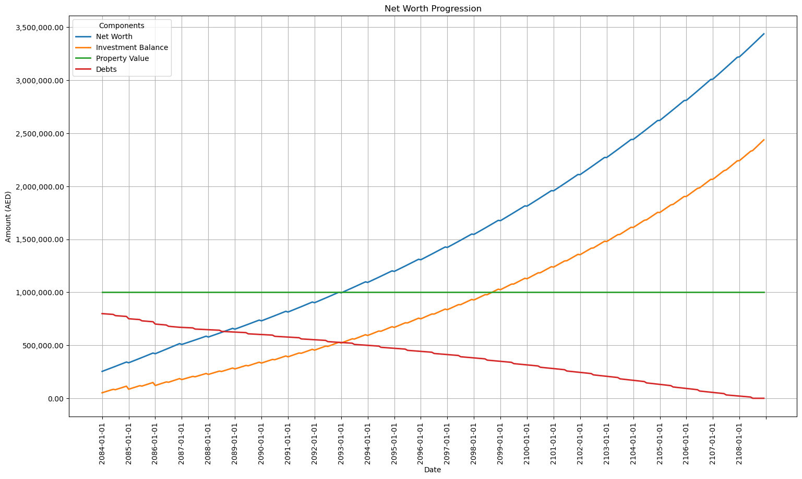

# Mortgage vs. Rent & Invest Calculator

This project compares the financial outcomes of a mortgage payment plan versus a rent & invest strategy.

## Features

- **Mortgage Calculation:**
  - Variable interest rates for different periods
  - Regular and arbitrary early repayments
  - Detailed payment plan and net worth progression

- **Rent & Invest Calculation:**
  - Investment balance progression
  - Rent payments, move-in costs, agency fees
  - Detailed balance progression and net worth comparison

- **Visualizations:**
  - Stacked bar graph for mortgage payments
  - Line plots for net worth progression
  - Net worth comparison between scenarios

## Usage

1. **Input Variables:**
   Modify the variables at the beginning of the script.

2. **Run the Script:**
   Execute the script in a Jupyter Notebook environment.

3. **Interpret Results:**
   Review the tables and plots to compare scenarios.

## Example Input Variables

| Variable                              | Value                  | Unit    | Description                                           |
|---------------------------------------|------------------------|---------|-------------------------------------------------------|
| `principal`                           | 800000                 | AED     | Loan amount                                           |
| `initial_rate`                        | 4.5                    | %       | Initial interest rate                                 |
| `initial_years`                       | 3                      | years   | Initial period                                        |
| `later_rate`                          | 8                      | %       | Later interest rate                                   |
| `total_years`                         | 25                     | years   | Total loan term                                       |
| `regular_early_repayment`             | 10000                  | AED     | Regular early repayment amount                        |
| `regular_early_repayment_interval`    | 12                     | months  | Interval of regular early repayment                   |
| `first_regular_early_repayment_date`  | '2084-07-01'           | date    | First regular early repayment date                    |
| `property_price`                      | 1000000                | AED     | Property price                                        |
| `property_size`                       | 850                    | sq ft   | Property size                                         |
| `maintenance_fees_rate`               | 18                     | AED/sq ft/year | Maintenance fees rate                         |
| `maintenance_fees_interval`           | 12                     | months  | Maintenance fees paid every                           |
| `monthly_salary`                      | 23456                  | AED     | Monthly salary                                        |
| `monthly_expenses`                    | 12345                  | AED     | Monthly expenses (excluding rent)                     |
| `initial_savings`                     | 345678                 | AED     | Initial savings                                       |
| `property_value_factor`               | 1.0                    | factor  | Property value remains the same                       |
| `annual_investment_rate`              | 4.5                    | %       | Annual investment interest rate                       |
| `valuation_fee`                       | 1750                   | AED     | Property valuation fee from the bank                  |
| `conveyance_fee`                      | 5250                   | AED     | Conveyance fee                                        |
| `bank_mortgage_opening_fee_rate`      | 1                      | %       | Bank mortgage opening fee rate                        |
| `life_insurance_rate`                 | 0.5                    | %       | Annual life insurance rate                            |
| `property_insurance_rate`             | 0.12                   | %       | Annual property insurance rate                        |
| `insurance_payment_interval`          | 1                      | months  | Insurance payment interval                            |
| `max_early_repayment_percent`         | 20                     | %       | Maximum allowed annual early repayment percentage     |
| `allow_exceed_early_repayment_limit`  | False                  | boolean | Allow exceeding early repayment limit with fees       |
| `start_date`                          | '2084-01-01'           | date    | Start date for payments                               |
| `arbitrary_early_repayments`          | [{'date': '2085-01-01', 'amount': 20000}, {'date': '2086-01-01', 'amount': 20000}] | list | Arbitrary early repayments                           |

| Variable                              | Value                  | Unit    | Description                                           |
|---------------------------------------|------------------------|---------|-------------------------------------------------------|
| `annual_rent`                         | 100000                 | AED     | Annual rent                                           |
| `rent_cheques`                        | 2                      | count   | Number of rent cheques per year                       |
| `years`                               | 25                     | years   | Investment period                                     |
| `change_apartment_interval`           | 3                      | years   | Change apartment every                                |
| `initial_amount`                      | 345678                 | AED     | Initial amount equal to initial savings               |
| `move_in_costs`                       | 3000                   | AED     | Move-in costs for each new apartment                  |

## Example Outputs

### Mortgage Payment Plan Table

### Mortgage Payment Plan Graph

### Mortgage Net Worth Breakdown

### Investment Net Worth Progression

### Net Worth Comparison Graph

## Legal Disclaimer

This script is for informational and educational purposes only and not intended as financial advice. Users should seek professional financial advice before making any decisions. The author does not guarantee the accuracy or completeness of the information and is not responsible for any errors, omissions, or losses.

## Acknowledgment

This code is generated by ChatGPT-4.

Prompt Engineering Manager: Igor @iDebugAll Korotchenkov.
